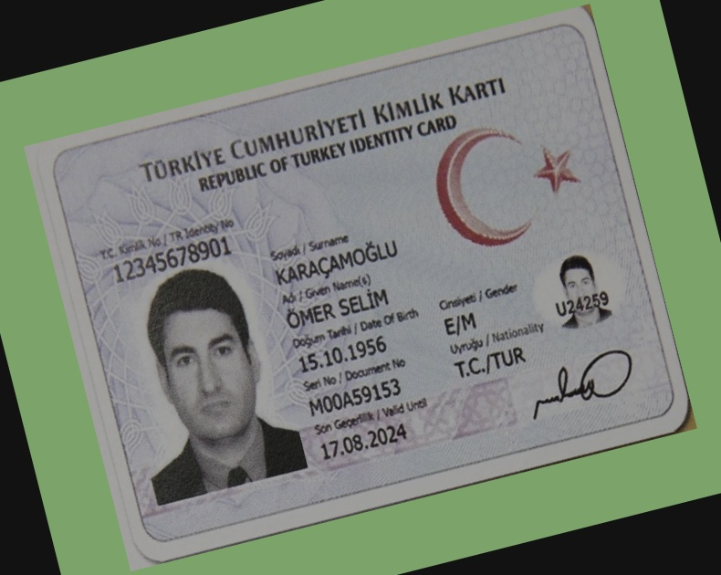

## ID Checker for Tc id cards

A simple flask server that has two routes;
    -/Idchecker : Take as input an image and return if it is a TC id and front or back picture.
    -/imageReader : Take an image as input and return from the front of the id; Tc, name, surname, dob and serie no.

The image id card recognition is based on a finetuned Yolov8 with mid500 and generated data of publicly available images.

Output of given image: 
`Extracted information from image: [['tc', 12345678901], ['surname', 'KARAÇAMOĞLU'], ['dob', datetime.datetime(1956, 10, 15, 0, 0)], ['serie_no', 'MOOA59153'], ['name', 'ÖMER SELİM']]`

Images with unwanted rotation are preprocessed before and rotated.

Easyocr is used to detect text on id cards. For more accurate detection a reference Tc id card bbox location is used.

Run flask server with `flask run` or `gunicorn -w 4 -b 0.0.0.0:5000 app:app` with 4 workers.